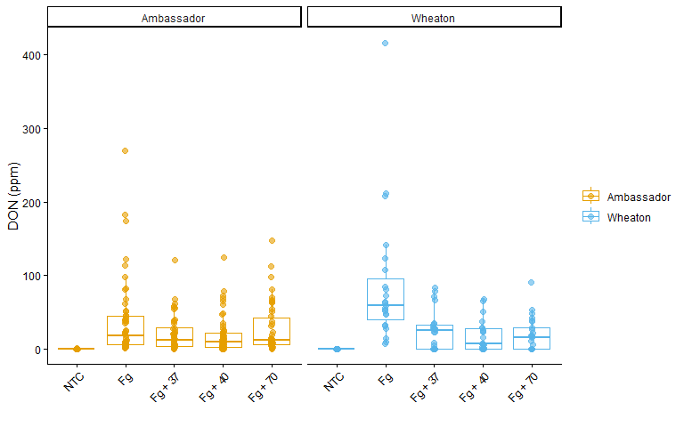
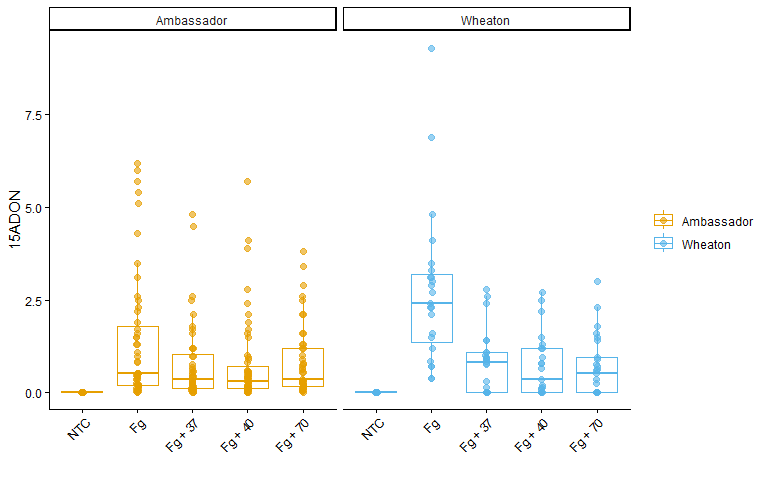
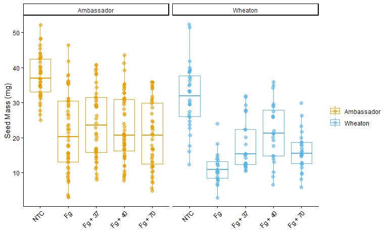
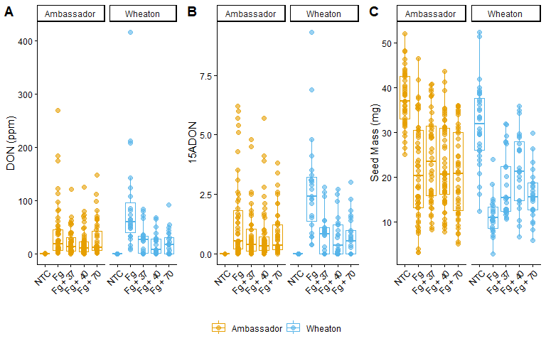

Coding Challenge 3: Data visualization 2
================
Tyler Winter
2026-02-19

# Question 1

## a. YAML Header

A YAML header is the section at the top of an R Markdown file between
three dashes `---`. It controls the document settings such as the title,
author, date, and output format when the file is knitted.

## b. Literate Programming

Literate programming is a way of writing code where explanation and code
are combined in the same document. This allows the text, analysis, and
results to be generated together.

# Question 2

The manuscript associated with this data can be found here:

[Noel et al. 2022. Endophytic fungi as promising biocontrol agent to
protect wheat from Fusarium graminearum head blight. Plant
Disease.](https://doi.org/10.1094/PDIS-06-21-1253-RE)

``` r
myco <- read.csv(
  "MycotoxinData.csv",
  na.strings = "na"
)

myco$Treatment <- as.factor(myco$Treatment)
myco$Cultivar  <- as.factor(myco$Cultivar)

# set treatment order
myco$Treatment_ordered <- factor(
  myco$Treatment,
  levels = c("NTC", "Fg", "Fg + 37", "Fg + 40", "Fg + 70")
)
```

``` r
# DON base
p_don <- ggplot(myco, aes(x = Treatment_ordered, y = DON, color = Cultivar)) +
  geom_boxplot(position = position_dodge(0.85), outlier.shape = NA) +
  geom_point(position = position_jitterdodge(0.05, dodge.width = 0.85),
             alpha = 0.6, size = 2) +
  facet_wrap(~Cultivar) +
  ylab("DON (ppm)") +
  xlab("") +
  scale_color_manual(values = cult_cols, name = "") +
  theme_classic() +
  theme(axis.text.x = element_text(angle = 45, hjust = 1))

# add pairwise
p_don_pwc <- p_don +
  geom_pwc(aes(group = Cultivar),
           method = "t_test",
           label = "p.adj.format",
           hide.ns = TRUE,
           step.increase = 0.06)

p_don_pwc
```

<!-- -->

``` r
# 15ADON base
p_15adon <- ggplot(myco, aes(x = Treatment_ordered, y = X15ADON, color = Cultivar)) +
  geom_boxplot(position = position_dodge(0.85), outlier.shape = NA) +
  geom_point(position = position_jitterdodge(0.05, dodge.width = 0.85),
             alpha = 0.6, size = 2) +
  facet_wrap(~Cultivar) +
  ylab("15ADON") +
  xlab("") +
  scale_color_manual(values = cult_cols, name = "") +
  theme_classic() +
  theme(axis.text.x = element_text(angle = 45, hjust = 1))

# add pairwise
p_15adon_pwc <- p_15adon +
  geom_pwc(aes(group = Cultivar),
           method = "t_test",
           label = "p.adj.format",
           hide.ns = TRUE,
           step.increase = 0.06)

p_15adon_pwc
```

<!-- -->

``` r
# Seed Mass base
p_seedmass <- ggplot(myco, aes(x = Treatment_ordered, y = MassperSeed_mg, color = Cultivar)) +
  geom_boxplot(position = position_dodge(0.85), outlier.shape = NA) +
  geom_point(position = position_jitterdodge(0.05, dodge.width = 0.85),
             alpha = 0.6, size = 2) +
  facet_wrap(~Cultivar) +
  ylab("Seed Mass (mg)") +
  xlab("") +
  scale_color_manual(values = cult_cols, name = "") +
  theme_classic() +
  theme(axis.text.x = element_text(angle = 45, hjust = 1))

# add pairwise
p_seedmass_pwc <- p_seedmass +
  geom_pwc(aes(group = Cultivar),
           method = "t_test",
           label = "p.adj.format",
           hide.ns = TRUE,
           step.increase = 0.06)

p_seedmass_pwc
```

<!-- -->

``` r
p_abc_pwc <- ggarrange(
  p_don_pwc,
  p_15adon_pwc,
  p_seedmass_pwc,
  ncol = 3,
  nrow = 1,
  labels = c("A", "B", "C"),
  common.legend = TRUE,
  legend = "bottom"
)

p_abc_pwc
```

<!-- -->
