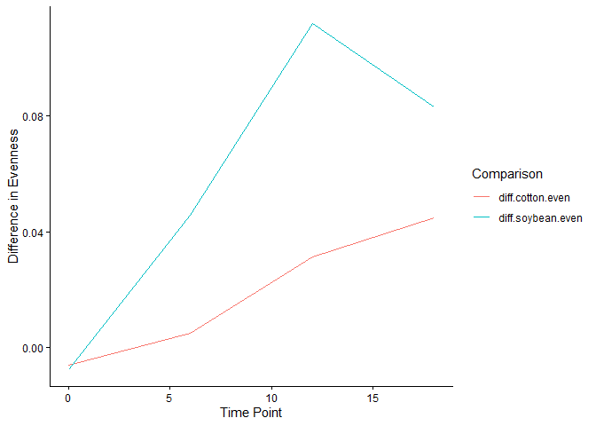

Coding Challenge 5: Data Wrangling
================
Your Name
2026-03-05

## Load Libraries

``` r
library(tidyverse)
```

## 1. Read in the Data

``` r
diversity <- read.csv("../../Week 09/DiversityData.csv")
metadata <- read.csv("../../Week 09/Metadata.csv")
```

## 2. Join the Two Dataframes

joining diversity and metadata by Code column

``` r
alpha <- inner_join(diversity, metadata, by = "Code")
```

## 3. Calculate Pielou’s Evenness Index

evenness = shannon / log(richness)

``` r
alpha_even <- alpha %>%
  mutate(even = shannon / log(richness))
```

## 4. Summarize by Crop and Time Point

``` r
alpha_average <- alpha_even %>%
  group_by(Crop, Time_Point) %>%
  summarise(
    mean.even = mean(even, na.rm = TRUE),
    n = n(),
    sd.even = sd(even, na.rm = TRUE),
    se.even = sd.even / sqrt(n)
  )
```

## 5. Calculate Differences Between Crop and Soil

pivot to wide format then calculate differences between soil and cotton
and soil and soybean

``` r
alpha_average2 <- alpha_average %>%
  select(Time_Point, Crop, mean.even) %>%
  pivot_wider(names_from = Crop, values_from = mean.even) %>%
  mutate(diff.cotton.even = Soil - Cotton,
         diff.soybean.even = Soil - Soybean)
```

## 6. Plot

``` r
alpha_average2 %>%
  select(Time_Point, diff.cotton.even, diff.soybean.even) %>%
  pivot_longer(c(diff.cotton.even, diff.soybean.even), names_to = "diff") %>%
  ggplot(aes(x = Time_Point, y = value, color = diff)) +
  geom_line() +
  labs(x = "Time Point", y = "Difference in Evenness", color = "Comparison") +
  theme_classic()
```

<!-- -->

## GitHub Link

[Coding Challenge 5 on
GitHub](https://github.com/Loxops/Rep_Ass/tree/master/Coding%20Challenge%205)
